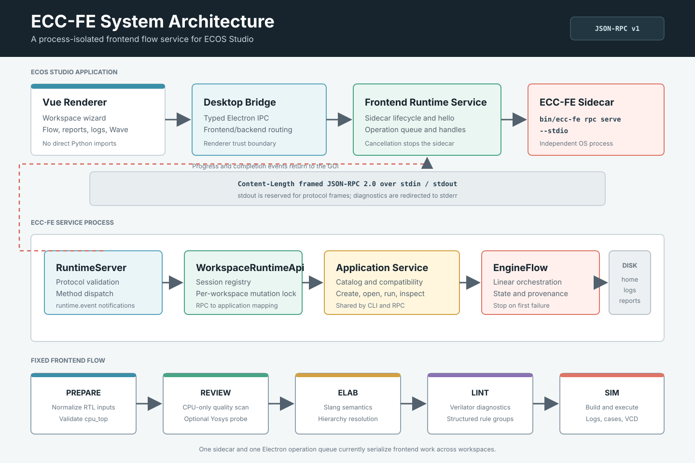
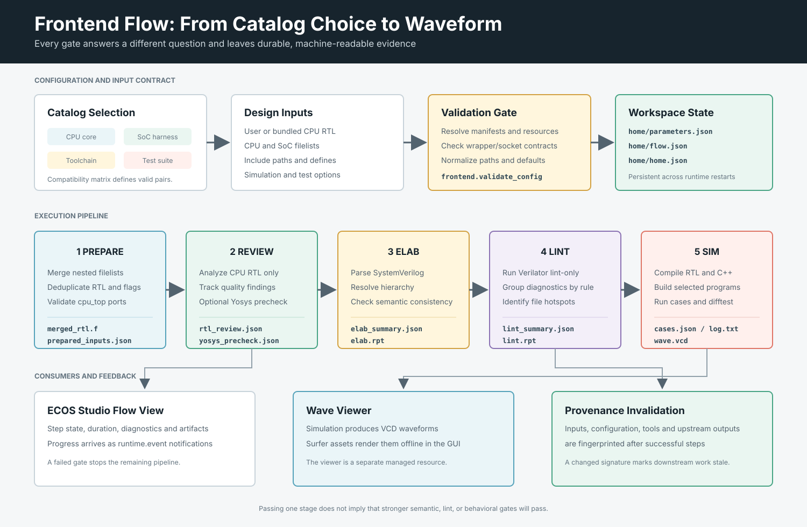
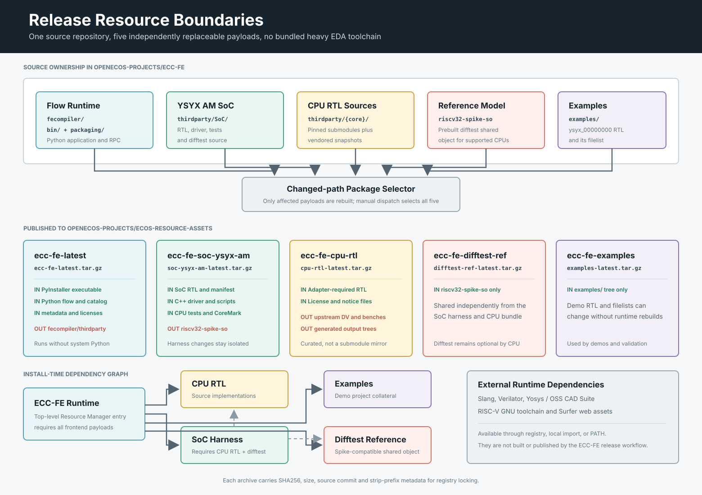
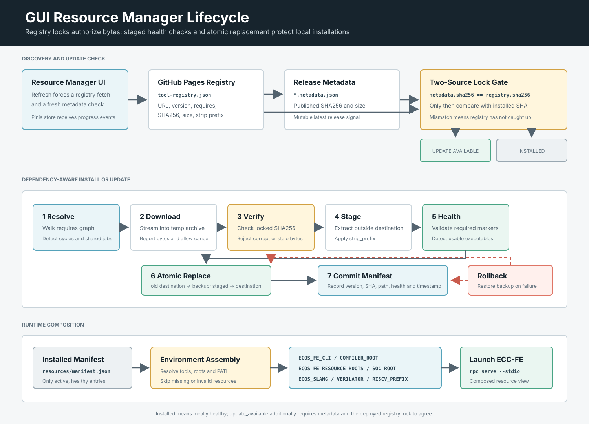
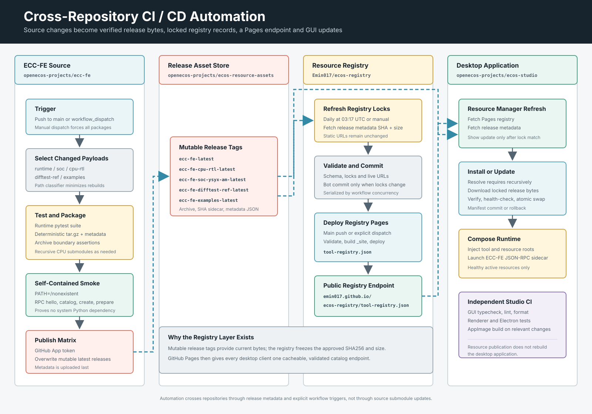

# ecc-fe

`ecc-fe` is a Python framework for front-end chip design flow orchestration,
aligned with [ecos-studio/ecc](https://github.com/ecos-studio/ecc)
(`chipcompiler/`).

It is both a standalone CLI and the process-isolated frontend runtime used by
ECOS Studio. The production GUI never imports `fecompiler` directly. Electron
starts `ecc-fe` as a sidecar and communicates with it through framed JSON-RPC.

The default flow is:

```text
prepare -> review -> elab -> lint -> sim
```

## Architecture Overview



The system deliberately separates the desktop application, the flow runtime,
large hardware resources, release storage, and the public registry. This keeps
the desktop and Python runtime independently replaceable while preserving a
single validated source of truth for installed resource bytes.

### Repository Ecosystem

Four repositories form the primary delivery path:

| Repository | Responsibility | Does not own |
| --- | --- | --- |
| [`openecos-projects/ecc-fe`](https://github.com/openecos-projects/ecc-fe) | Frontend catalog, workspace application service, JSON-RPC runtime, flow engine, step implementations, adapters, packaging rules, and ECC-FE release automation. | Desktop UI, the public registry endpoint, or long-term release asset storage. |
| [`openecos-projects/ecos-resource-assets`](https://github.com/openecos-projects/ecos-resource-assets) | Mutable `latest` GitHub Releases containing ECC-FE runtime and resource archives, checksums, and release metadata. | Source code, dependency policy, or client installation state. |
| [`Emin017/ecos-registry`](https://github.com/Emin017/ecos-registry) | Registry schema, dependency declarations, approved SHA256/size locks, validation, scheduled lock refresh, and the GitHub Pages registry endpoint. | Release archive contents or local installation behavior. |
| [`openecos-projects/ecos-studio`](https://github.com/openecos-projects/ecos-studio) | Vue GUI, Electron IPC, sidecar lifecycle, Resource Manager, local resource manifest, runtime environment composition, Wave integration, and desktop release builds. | ECC-FE flow implementation or mutable resource releases. |

`ecc-fe` is checked out as an `ecos-studio` git submodule for source development
and integration testing. A packaged desktop installation does not execute the
submodule checkout: Resource Manager installs the published `ecc-fe` runtime
and supplies its executable through `ECOS_FE_CLI`.

The CPU implementations referenced by built-in adapters have their own upstream
repositories. Most are pinned as submodules under `fecompiler/thirdparty`; CVA6
and VexRiscv are intentionally vendored snapshots. Those upstream repositories
provide source inputs, but they do not participate directly in the ECOS release
automation shown below.

### Runtime Layers

| Layer | Primary implementation | Responsibility |
| --- | --- | --- |
| Renderer | `ecos-studio/ecos/gui/apps/renderer` | Workspace wizard, flow controls, reports, logs, Wave UI, and Resource Manager UI. |
| Electron bridge | `ecos-studio/ecos/gui/apps/desktop-electron` | Typed IPC, frontend/backend routing, sidecar launch, operation events, cancellation, and workspace handles. |
| Transport | `fecompiler/runtime/stdio_server.py` | `Content-Length` framed JSON-RPC 2.0 over stdin/stdout. stdout is reserved for frames; diagnostics go to stderr. |
| Runtime API | `fecompiler/runtime/server.py` and `workspace_api.py` | Protocol validation, capabilities, workspace sessions, per-workspace mutation locks, and event notifications. |
| Application service | `fecompiler/application/workspace_service.py` | Shared CLI/RPC use cases for catalog validation, workspace lifecycle, flow execution, and report shaping. |
| Flow engine | `fecompiler/engine/flow.py` | Fixed step ordering, state transitions, provenance fingerprints, stale-result invalidation, and failure propagation. |
| Step handlers | `fecompiler/tools/*` | RTL preparation, CPU review, Slang elaboration, Verilator lint, simulation build, tests, difftest, logs, and artifacts. |

The runtime currently uses one Electron-side operation queue and one ECC-FE
sidecar. Frontend operations are therefore serialized across workspaces.
Cancellation terminates the sidecar process; durable workspace files remain on
disk, and Electron reopens workspace sessions lazily after the runtime restarts.

The private protocol exposes these stable method groups:

```text
rpc.hello / rpc.ping / rpc.shutdown
frontend.catalog / frontend.validate_config
workspace.create / open / close / home / info
workspace.refresh_config / sync_config / reset_flow
flow.run / flow.run_step
```

## Repository Layout

```text
ecc-fe/
├── BUILD.bazel                 # Bazel targets: CLI, examples, tests
├── MODULE.bazel                # Bazel module config
├── docs/
│   ├── architecture/*.svg      # system and delivery architecture diagrams
│   └── *.md                    # user and developer documentation
├── examples/
│   └── ysyx_00000000/          # Bundled RV32I + Zicsr CPU example
├── fecompiler/
│   ├── allflow/                # DEFAULT_FLOW_STEPS
│   ├── cli/                    # ecc-fe command line entry point
│   ├── data/                   # workspace/flow/state persistence
│   ├── engine/                 # EngineFlow orchestration
│   ├── tools/
│   │   ├── prepare/            # merge CPU/SoC/filelist inputs
│   │   ├── review/             # CPU-only RTL quality and Yosys precheck
│   │   ├── slang/              # slang elaboration step
│   │   ├── verilator/          # lint + simulation step
│   │   ├── common/             # shared RTL parsing helpers
│   │   └── fe/                 # step workspace/subflow helpers
│   ├── thirdparty/
│   │   ├── SoC/                # YSYX AM harness, tests, driver, difftest
│   │   ├── {cpu-submodule}/    # pinned upstream CPU RTL repositories
│   │   └── {cpu-snapshot}/     # intentionally vendored CPU RTL snapshots
│   └── utility/                # JSON/file/log helpers
├── test/                       # unit and integration tests
└── workspace_projects/         # generated workspaces, git-ignored
```

## Flow Steps



```text
prepare (fe)        normalize CPU/SoC/filelist inputs
review  (fe)        CPU-only RTL quality review and optional Yosys precheck
elab    (slang)     SystemVerilog elaboration and hierarchy/semantic check
lint    (verilator) Verilator lint diagnostics
sim     (verilator) compile simulator, build images, run simulation cases
```

### Step Responsibilities

Each step answers a different question.  The separation is intentional: a
design can pass one step and still fail a later step because later steps use
stronger tools or require more runtime context.

| Step | Main question | What it does | Key outputs | Failure meaning |
| --- | --- | --- | --- | --- |
| `prepare` | Are the selected CPU, SoC harness, wrappers, include paths, defines, and filelists normalized into one usable RTL input set? | Parses CPU filelists, SoC filelists, adapter filelists, nested `.f` files, `+incdir+` entries, and `+define+` entries.  It also records source metadata and writes the merged RTL view consumed by later steps. | `prepare_fe/output/merged_rtl.f`, `prepare_fe/output/prepared_inputs.json`, `prepare_fe/report/prepare.rpt` | The project inputs are structurally incomplete: missing RTL, missing wrapper/socket expectations, bad filelist paths, or incompatible catalog metadata. |
| `review` | Is the user CPU RTL healthy enough to inspect before running compiler-grade checks? | Reviews CPU RTL only and intentionally ignores the SoC harness.  It scans source text for RTL quality risks such as clock/reset usage, always-block style, case/default patterns, assignment style, hot signal references, and other static review hints.  If Yosys is available, it also runs a bounded CPU-only structural precheck to estimate module risk, fanin/fanout candidates, combinational depth candidates, inferred cells, and structural diagnostics. | `review_fe/report/rtl_review.json`, `review_fe/report/rtl_review_summary.md`, `review_fe/report/yosys_precheck.json`, `review_fe/report/yosys_precheck.log` | A blocking CPU RTL quality issue was found, or Yosys produced a real parse/hierarchy/structural error.  If Yosys is unavailable, review can still succeed with the source-scan portion and reports Yosys as unavailable. |
| `elab` | Can a SystemVerilog frontend understand the complete design hierarchy? | Runs full Slang elaboration on the prepared RTL. It checks syntax, package/include/define handling, module resolution, top selection, parameter/port structure, and semantic consistency. The source-scanned module inventory is informational; only Slang diagnostics are authoritative for unresolved modules and readiness. | `elab_slang/report/log.txt`, `elab_slang/report/elab_summary.json`, `elab_slang/report/elab.rpt` | The RTL cannot be elaborated as a complete SystemVerilog design: syntax errors, unresolved modules, bad hierarchical references, bad packages/includes, or incompatible language constructs. |
| `lint` | Does Verilator accept the RTL for simulation-oriented lint rules? | Runs `verilator --lint-only` with the prepared files, include directories, defines, and top module.  It parses Verilator diagnostics into structured errors, warnings, rule groups, and per-file hotspots for GUI display. | `lint_verilator/report/log.txt`, `lint_verilator/report/lint_summary.json`, `lint_verilator/report/lint.rpt` | Verilator found errors or returned a non-zero status.  Typical causes include unsupported constructs, width/range problems, undriven or multidriven signals, missing pins, latch/case warnings promoted by policy, or tool invocation problems. |
| `sim` | Can the selected CPU and SoC harness build and run real software images? | Compiles the prepared RTL plus the configured C++ simulator testbench with Verilator. It builds requested test programs when needed, runs each simulation case, captures logs, preserves per-run history, and emits VCD waveforms. | `sim_verilator/output/<design>_sim`, `sim_verilator/output/cases/<case>/`, `sim_verilator/report/cases.json`, `sim_verilator/report/log.txt`, `sim_verilator/report/runs/<run_id>/` | The simulator failed to compile, a test image could not be built, a case returned failure, timeout policy failed, or the runtime/testbench configuration is incomplete. |

### How To Read The Steps

- `prepare` is an input-contract step.  It does not prove RTL correctness.
- `review` is a CPU-quality step.  It is deliberately CPU-only so SoC harness
  glue does not hide user RTL issues.
- `elab` is a frontend semantic gate.  It answers whether the design can be
  understood as a SystemVerilog hierarchy.
- `lint` is a Verilator compatibility and coding-diagnostics gate.  It is not
  a replacement for `review` or `elab`.
- `sim` is the executable behavior gate.  Passing earlier steps does not
  guarantee software-visible behavior is correct.

## Frontend Catalog Adapter Contract

Open-source CPU and SoC integrations are catalog driven.  A CPU or SoC should
only be marked `sim_ready` after its wrapper/filelist/runtime manifest follows
the shared ECOS contracts:

- CPU wrapper contract: `ecos-cpu-wrapper-v1`
- CPU socket contract: `ysyx-axi-cpu-socket-v1`
- SoC simulator wrapper contract: `ecos-sim-wrapper-v1`
- SoC simulator top: `ecos_sim_top`

The high-level shape is:

```text
User CPU RTL -> selected top (cpu_top by default) -> fixed ECOS SoC wrapper/harness
                                               -> ecos_sim_top
Bundled CPU RTL -> bundled adapter-owned cpu_top -> fixed ECOS SoC wrapper/harness
                                                   -> Verilator main.cpp / GUI
```

### User CPU Filelist Contract

`ecc-fe` exposes `custom-filelist` as **My CPU Top** in the GUI. The selected
RTL filelist may include the CPU's implementation files, but it must provide
exactly one module with the configured CPU top name. The default is `cpu_top`;
the GUI and CLI may set another simple SystemVerilog identifier through
`cpu_top_module` / `--cpu-top-module`.

The selected module must use the flat YSYX BlackBox interface demonstrated by
`examples/ysyx_00000000/rtl/ysyx_00000000.sv`: `clock`, `reset`,
`io_interrupt`, and the complete `io_master_*` and `io_slave_*` AXI channels.
ECOS passes the selected module name to its fixed SoC harness; users do not
provide a compatibility alias.

The bundled `ysyx_00000000` example is an RV32I + Zicsr core. It uses the
native `ysyx_00000000` module as its CPU top and includes a single-retirement
ECC-FE difftest adapter. Compile its test programs with `-march=rv32i_zicsr`
and `-mabi=ilp32`; the GUI enables the packaged reference model automatically.

The fixed SoC wrapper preserves the simulator MMIO convention used by CPU tests:
UART writes to `0x1000_0000` are printed, and writes to `0x1000_000c` terminate
the run as GOOD/BAD TRAP depending on the written value.

The CPU must reset its first instruction fetch to `0x2000_0000`. Normal CPU
tests are linked at that address. This address is part of the catalog contract
and is stored in every workspace; changing it requires a matching CPU wrapper,
SoC harness, linker, and simulation configuration.

Before claiming a new adapter is runnable, run the static catalog check:

```bash
ecc-fe workspace catalog-check --json
```

This command does not build or simulate.  It checks that `sim_ready` catalog
entries have concrete filelists, wrapper tops, runtime manifests, C++ simulator
sources, and at least one supported test suite.

## Workspace Output

Each project is created under `workspace_projects/<design>/` by default.

```text
workspace_projects/<design>/
├── home/
│   ├── parameters.json
│   ├── flow.json
│   └── home.json
├── origin/                         # copied or generated inputs
├── log/log.txt                     # flow-level status
├── prepare_fe/output/
│   ├── merged_rtl.f
│   └── prepared_inputs.json
├── review_fe/report/
│   ├── rtl_review.json
│   ├── rtl_review_summary.md
│   ├── yosys_precheck.json
│   └── yosys_precheck.log
├── elab_slang/report/log.txt
├── elab_slang/report/elab_summary.json
├── lint_verilator/report/log.txt
├── lint_verilator/report/lint_summary.json
└── sim_verilator/
    ├── output/<design>_sim         # compiled simulator
    ├── output/cases/<case>/
    │   ├── <case>.bin              # built test image
    │   ├── log.txt                 # latest case log
    │   └── wave.vcd
    ├── report/cases.json           # latest machine-readable case summary
    ├── report/log.txt              # latest simulation summary
    ├── report/cases/<case>/log.txt
    └── report/runs/<run_id>/       # retained run history
```

## Python API

Most backend usage goes through workspace creation plus `EngineFlow`.

```python
from fecompiler.data.workspace import CreateWorkspaceData, create_workspace, load_workspace
from fecompiler.engine.flow import EngineFlow

spec = CreateWorkspaceData(
    directory="/home/luyoung/ecc-fe/workspace_projects/cpu_soc_test",
    parameters={"Design": "cpu_soc_test", "Top module": "ecos_sim_top"},

    # RTL inputs
    cpu_filelist="/path/to/cpu/filelist.cpu.f",
    soc_filelist="/path/to/SoC/filelist.soc.f",

    # Verilator simulator
    testbench="/path/to/SoC/driver/main.cpp",
    sim_cpp_sources=[
        "/path/to/SoC/driver/dpi_mem.cpp",
        "/path/to/SoC/driver/difftest.cpp",
    ],
    sim_cflags=["-I/path/to/SoC"],
    sim_ldflags=["-ldl"],

    # Runtime args
    sim_run_args=[
        "--max-cycles", "10000000",
        "--diff",
        "--ref", "/path/to/SoC/tools/riscv32-spike-so",
        "--diff-image-offset", "0x100",
        "--diff-reset-vector", "0x80000000",
    ],

    # Case selection
    sim_build_all_programs=True,
    sim_programs_dir="/path/to/SoC/tests/programs",
    sim_program_names=[],
    sim_tests_out_dir="",            # default: sim_verilator/output/cases/<case>/
)

ws = create_workspace(spec)
engine = EngineFlow(ws)
engine.create_step_workspaces()
ok, reports = engine.run_all(rerun=True)
```

Useful step calls:

```python
engine.run_step("prepare", rerun=True)
engine.run_step("review", rerun=True)
engine.run_step("elab", rerun=True)
engine.run_step("lint", rerun=True)
engine.run_step("sim", rerun=True)
```

Step states are `Invalid`, `Unstart`, `Success`, `Ongoing`, `Pending`, and
`Incomplete`.

## CLI

`ecc-fe` is the stable command line boundary for ECOS Studio integration.
The GUI invokes this command and consumes JSON responses instead of importing
internal Python modules directly.  The legacy `fecompiler` console script and
`python3 -m fecompiler.cli.main` entry point are kept as compatibility aliases.

```bash
cd /home/luyoung/ecc-fe

ecc-fe \
  --design ysyx_00000000_soc \
  --top ecos_sim_top \
  --cpu-top-module ysyx_00000000 \
  --cpu-filelist examples/ysyx_00000000/filelist.cpu.f \
  --soc-filelist fecompiler/thirdparty/SoC/filelist.soc.f \
  --testbench fecompiler/thirdparty/SoC/driver/main.cpp \
  --sim-cpp fecompiler/thirdparty/SoC/driver/dpi_mem.cpp \
  --sim-cpp fecompiler/thirdparty/SoC/driver/difftest.cpp \
  --sim-cflag=-Ifecompiler/thirdparty/SoC \
  --sim-ldflag=-ldl \
  --sim-compile-march rv32i_zicsr \
  --sim-compile-mabi ilp32 \
  --sim-compile-opt-level=-O2 \
  --sim-program add \
  --sim-arg=--max-cycles \
  --sim-arg=10000000 \
  --sim-arg=--diff \
  --sim-arg=--ref \
  --sim-arg=fecompiler/thirdparty/SoC/tools/riscv32-spike-so \
  --sim-arg=--diff-image-offset \
  --sim-arg=0x100 \
  --sim-arg=--diff-reset-vector \
  --sim-arg=0x80000000 \
  --rerun
```

Workspace-oriented commands use a JSON protocol suitable for GUI adapters:

```bash
ecc-fe workspace create --input-json request.json --json
ecc-fe workspace load --directory /path/to/workspace --json
ecc-fe workspace run-step --directory /path/to/workspace --step elab --json
ecc-fe workspace run-flow --directory /path/to/workspace --rerun --json
ecc-fe workspace get-info --directory /path/to/workspace --step sim --id cases --json
ecc-fe workspace get-home --directory /path/to/workspace --json
```

## Bazel Commands

```bash
# ysyx_00000000 CPU + SoC example
bazel run //:run_ysyx_00000000_soc

# Main regressions
bazel test //:test_cpu_soc_flow --test_output=errors --test_env=PATH="$PATH"
bazel test //:test_cpu_soc_matrix_flow --test_output=errors --test_env=PATH="$PATH"
bazel test //:all_tests --test_output=errors --test_env=PATH="$PATH"
```

## Tests

```bash
python3 -m pytest test/test_utility.py test/test_data_step.py test/test_allflow_builder.py -q
python3 -m pytest test/test_data_workspace.py test/test_engine_flow.py -q
python3 -m pytest test/test_examples.py -q
```

Detailed test notes live in [`test/README.md`](test/README.md).

## Release Resource Architecture



The source checkout is intentionally much larger than the installed runtime.
Release packaging cuts it into independently updateable payloads so that a CPU
RTL change does not require redistributing the Python runtime, and a difftest
binary change does not require republishing the complete SoC harness.

| Resource | Published content | Explicit boundary |
| --- | --- | --- |
| `ecc-fe` | Self-contained PyInstaller executable, `fecompiler` application code, catalog data, adapters, metadata, and licenses. | Removes `fecompiler/thirdparty`. The packaged executable is tested with `PATH=/nonexistent` and does not require system Python. |
| `ecc-fe-soc-ysyx-am` | `fecompiler/thirdparty/SoC`: wrapper RTL, peripherals, manifest, catalog, C++ simulator driver, build scripts, CPU tests, and CoreMark sources. | Removes `tools/riscv32-spike-so`; the reference model is independently versioned. |
| `ecc-fe-cpu-rtl` | Only RTL trees required by built-in adapter filelists, plus applicable license and notice files. | Excludes unrelated upstream DV, benches, examples, dependencies, generated output, and waveform trees. It is a curated package, not a full submodule mirror. |
| `ecc-fe-difftest-ref` | `tools/riscv32-spike-so`. | Contains the reference shared object only. Difftest support remains part of compatible simulation configurations. |
| `ecc-fe-examples` | The `examples/` tree, including the bundled `ysyx_00000000` RTL and filelist. | Demo collateral can evolve independently from runtime code. |

Each archive has a deterministic root name and is published with:

```text
<resource>-latest.tar.gz
<resource>-latest.tar.gz.sha256
<resource>-latest.metadata.json
```

Metadata records the archive name, strip prefix, source commit, reproducible
build timestamp, SHA256, and size. The release workflow publishes the archive
and checksum first and metadata last, making metadata the update-discovery
signal for registry automation.

### Selective Release Rules

A push to `ecc-fe/main` runs the changed-path classifier in
`.github/scripts/select-release-packages.sh`. Runtime code selects `runtime`,
SoC changes select `soc`, a change to the Spike shared object selects
`difftest-ref`, CPU submodule or third-party CPU changes select `cpu-rtl`, and
example changes select `examples`. Changes to release infrastructure select all
packages. A manual workflow dispatch also forces all packages.

Selected archives are checked for required and forbidden entries before they
are published. The publish job uses a matrix and a GitHub App token to overwrite
the corresponding mutable release in `ecos-resource-assets`. Mutable tags are
only transport locations; clients trust registry locks, not the tag name.

## Tool Dependencies

`ecc-fe` does not carry Slang, Verilator, Yosys, Surfer, or the RISC-V GCC
toolchain as repo-local binaries. Supply them through ECOS Studio Resource
Manager when a registry entry is available, import a local resource, or make an
equivalent executable available on `PATH`.

The frontend flow consumes these runtime contracts:

```text
slang                         # or ECOS_SLANG=/path/to/slang
verilator                     # or ECOS_VERILATOR=/path/to/verilator
riscv32-unknown-elf-gcc       # or RISCV_PREFIX=<prefix>
yosys                         # or an OSS CAD Suite resource root
ECOS_SURFER_ASSETS_PATH       # offline Surfer web application used by Wave
```

When `ecc-fe` is installed as a managed runtime, Electron composes separately
installed frontend resources into one process environment:

```text
ECOS_FE_CLI=/path/to/ecc-fe/bin/ecc-fe
ECOS_FE_COMPILER_ROOT=/path/to/ecc-fe
ECOS_FE_RESOURCE_ROOTS=/path/to/cpu-rtl:/path/to/soc:/path/to/difftest:/path/to/examples
ECOS_FE_SOC_ROOT=/path/to/ecc-fe-soc-ysyx-am
```

`ECOS_FE_RESOURCE_ROOTS` is an ordered path list. Catalog discovery and
third-party path resolution search these roots before falling back to resources
inside a source checkout.

## Resource Manager Integration



The registry and Resource Manager solve different problems:

- `ecos-registry` defines available versions, dependency edges, archive URLs,
  strip prefixes, and approved SHA256/size locks. GitHub Pages publishes the
  file consumed by desktop clients.
- ECOS Studio Resource Manager owns local downloads, installation state,
  dependency resolution, health checks, cancellation, atomic replacement,
  rollback, and runtime environment construction.
- `ecos-resource-assets` stores mutable release bytes and metadata but does not
  decide whether those bytes are approved for installation.

The default desktop endpoint is:

```text
https://emin017.github.io/ecos-registry/tool-registry.json
```

The GUI **Refresh** action bypasses the in-memory registry cache and performs a
fresh update check. For mutable `latest` resources, update detection is a
two-source gate:

1. Fetch the deployed registry lock from GitHub Pages.
2. Fetch the current release SHA256 from `metadata_url`.
3. Require the metadata SHA256 to equal the registry SHA256.
4. Only then compare that SHA256 with the local installation manifest.

If metadata and registry disagree, the GUI deliberately reports no update and
records `Registry lock has not caught up with the published asset`. This avoids
downloading newly overwritten release bytes before the registry has approved
their exact checksum. `Installed` means that a local resource is active and
healthy; `Update available` additionally requires the lock gate above to pass.

Installing or updating `tool:ecc-fe` recursively resolves its `requires` graph.
The current frontend dependency contract is:

```text
tool:ecc-fe
  -> tool:ecc-fe-cpu-rtl
  -> tool:ecc-fe-soc-ysyx-am
  -> tool:ecc-fe-difftest-ref
  -> tool:ecc-fe-examples

tool:ecc-fe-soc-ysyx-am
  -> tool:ecc-fe-cpu-rtl
  -> tool:ecc-fe-difftest-ref
```

For every missing or stale dependency, Resource Manager downloads to a
temporary archive, verifies the registry SHA256, extracts to a staging
directory, validates resource-specific health markers, moves the previous
installation to a backup, moves the staged directory into place, and commits
the local manifest. If replacement or manifest commit fails, the backup is
restored. Concurrent requests for the same resource share the active operation,
and dependency cycles are rejected.

Only active resources that pass health checks contribute to the ECC-FE process
environment. In particular, Resource Manager injects the runtime executable,
frontend resource roots, SoC root, Slang and Verilator paths, RISC-V prefix,
Yosys/OSS CAD root, and offline Surfer asset path.

## CI/CD Automation



The release path is asynchronous across repository boundaries. No source
repository is made writable by another repository's ordinary `GITHUB_TOKEN`.
Release assets and metadata are the integration contract.

| Repository workflow | Trigger | Result |
| --- | --- | --- |
| `ecc-fe/.github/workflows/release-latest.yml` | Push to `main` or manual dispatch. | Selects affected packages, runs runtime tests when needed, verifies archive boundaries, smoke-tests the standalone executable, and publishes mutable release assets through a scoped GitHub App token. |
| `ecos-registry/.github/workflows/ci.yml` | Pull request or push to `main`. | Runs registry unit tests and validates schema, locks, examples, and live URLs. |
| `ecos-registry/.github/workflows/refresh-locks.yml` | Daily at `03:17 UTC` or manual dispatch. | Fetches release metadata, updates changed SHA256/size locks, validates the result, commits changed locks, and explicitly dispatches Pages deployment after a bot commit. |
| `ecos-registry/.github/workflows/pages.yml` | Push to `main` or explicit dispatch. | Validates `tool-registry.json`, builds the static `_site` artifact, and deploys it to GitHub Pages. |
| `ecos-studio/.github/workflows/ci.yml` | Pull request, push to `main`/release branches, or manual dispatch. | Path-selects GUI checks, typechecks, lints, checks formatting, runs Renderer/Electron tests, and builds an AppImage when relevant. |
| `ecos-studio/.github/workflows/release.yml` | Version tag or manual tagged release. | Builds and publishes the desktop AppImage. It does not embed the mutable ECC-FE resource archives. |

The end-to-end update sequence is therefore:

1. Merge an ECC-FE source or resource change into `ecc-fe/main`.
2. ECC-FE CI selects, tests, packages, and publishes the affected mutable
   releases to `ecos-resource-assets`.
3. Registry lock refresh reads each release's metadata and updates only changed
   SHA256/size fields in `tool-registry.json`.
4. Registry validation proves that schema, dependencies, locks, and URLs are
   usable.
5. GitHub Pages deploys the validated registry. An explicit dispatch is needed
   after the scheduled workflow's bot commit because pushes made with a
   repository `GITHUB_TOKEN` do not recursively trigger downstream workflows.
6. ECOS Studio Refresh fetches the Pages registry and release metadata, then
   exposes updates whose checksums agree.
7. Resource Manager installs dependencies and atomically replaces local
   resources. The next ECC-FE sidecar launch receives the new resource roots.

Publishing ECC-FE resources does not require rebuilding or releasing an
AppImage. The desktop consumes registry-managed resources at runtime, which is
the main operational benefit of this separation.

## Third-Party Resource Provenance

Most CPU RTL sources in `fecompiler/thirdparty` are pinned git submodules:
`cv32e40p`, `darkriscv`, `ibex`, `learn-fpga`, `picorv32`, `scr1`, and
`serv`. The `cva6` and `vexriscv` directories are vendored snapshots, so
updates to them must record the upstream source and commit in release notes or
the change log.

The CPU RTL release package copies an explicit allowlist from those trees. Its
archive checks require representative adapter RTL and forbid known upstream DV,
bench, dependency, and generated-output directories. The current resource and
test-suite contract does not include RT-Thread sources or RT-Thread tests.

The SoC harness and difftest reference remain separate even though the SoC
driver can use difftest. This allows CPUs that do not support the reference
model to run supported smoke, CPU test, and CoreMark configurations without
making the reference binary part of the runtime archive.

## Documentation

- Chinese walkthrough: [`docs/README.zh-CN.md`](docs/README.zh-CN.md)
- Test-suite details: [`test/README.md`](test/README.md)
