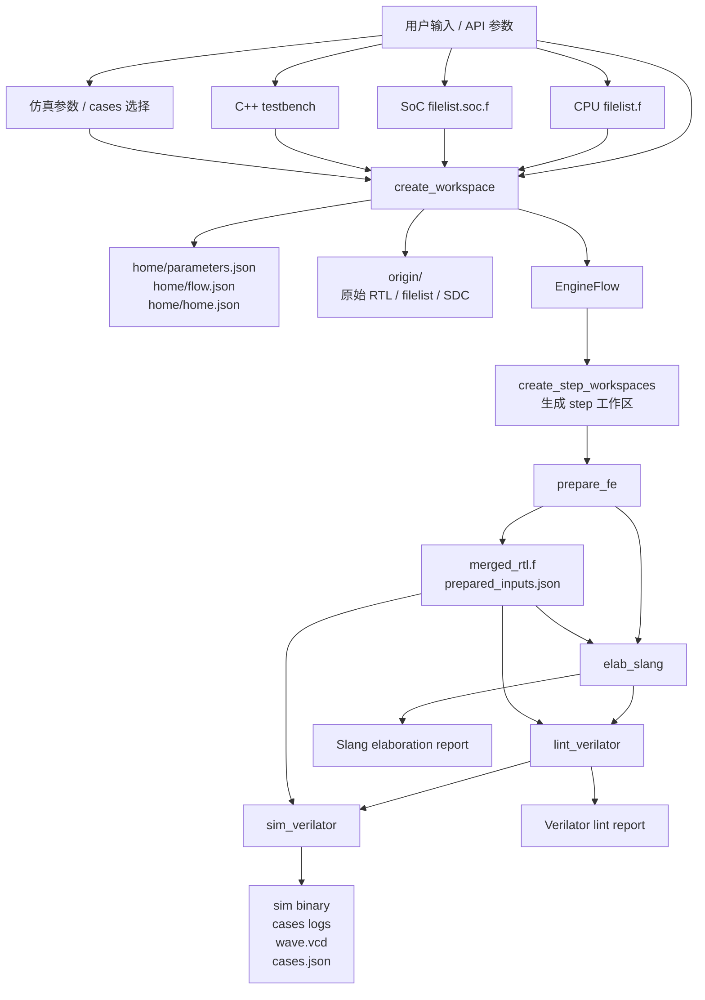
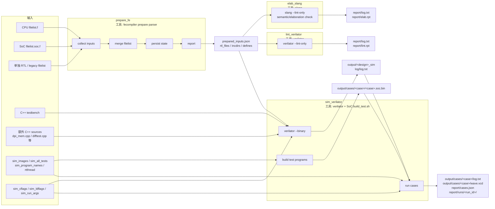
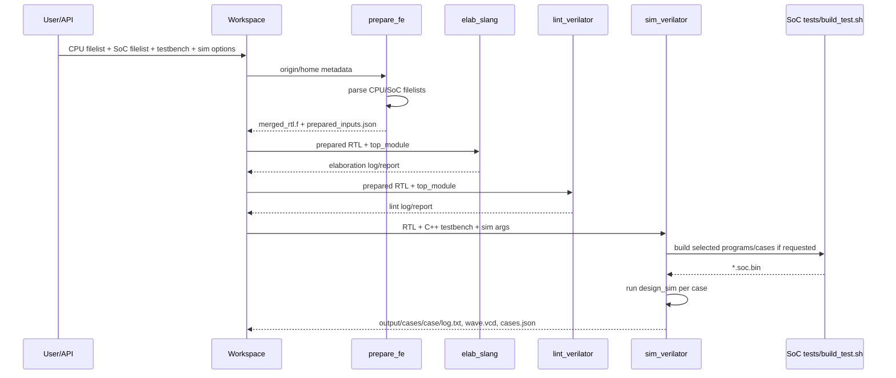

# FE 流程图与依赖

本文档描述 `ecc-fe` 当前默认前端流程，以及每一步依赖的工具、输入和输出。

默认步骤来自 `fecompiler/allflow/builder.py`：

```text
prepare -> elab -> lint -> sim
```

## 总览图



## 依赖关系图



## Step 目录结构

每一步由 `fecompiler/tools/fe/builder.py` 生成统一目录：

```text
<workspace>/<step>_<tool>/
├── config/
│   └── flow_config.json
├── input/
├── output/
│   ├── <design>_<step>.def.gz
│   ├── <design>_<step>.v
│   ├── <design>_<step>.gds
│   └── <design>_<step>.json
├── report/
│   └── <step>.rpt
├── log/
│   └── log.txt
├── script/
├── analysis/
├── subflow.json
└── checklist.json
```

`sim_verilator` 会额外产生：

```text
sim_verilator/
├── output/
│   ├── <design>_sim
│   └── cases/
│       └── <case>/
│           ├── <case>.soc.bin
│           ├── log.txt
│           └── wave.vcd
├── report/
│   ├── log.txt
│   ├── build_programs.log.txt
│   ├── cases.json
│   ├── cases/<case>/log.txt
│   └── runs/<run_id>/
└── log/log.txt
```

## 各步骤明细

| Step | Tool | 主要输入 | 主要输出 | 子步骤 |
|---|---|---|---|---|
| `prepare_fe` | Python parser | `cpu_filelist`, `soc_filelist`; 或 legacy `input_filelist`; 或 `origin_verilog` | `output/merged_rtl.f`, `output/prepared_inputs.json`, `report/prepare.rpt` | `collect inputs`, `merge filelist`, `persist state`, `report` |
| `elab_slang` | `fecompiler/tools/slang/bin/slang` 或 PATH 中的 `slang` | `prepared_inputs.json` 中的 RTL / incdirs / defines, `top_module` | `report/log.txt`, `report/elab.rpt` | `elaborate`, `report` |
| `lint_verilator` | repo-local 或系统 `verilator` | `prepared_inputs.json` 中的 RTL / incdirs / defines, `top_module` | `report/log.txt`, `report/lint.rpt` | `lint`, `report` |
| `sim_verilator` | `verilator --binary`; 可选 SoC `scripts/build_test.sh`; 可选 difftest ref so | RTL, `testbench`, `sim_cpp_sources`, `sim_cflags`, `sim_ldflags`, `sim_run_args`, cases 配置 | `output/<design>_sim`, `output/cases/<case>/`, `report/cases.json`, `report/runs/<run_id>/` | `compile`, `simulate`, `report` |

## 数据如何流动

1. 用户创建 workspace 时传入 CPU、SoC、testbench、仿真参数等。
2. `home/parameters.json` 持久化这些参数，`home/flow.json` 保存全流程状态。
3. `prepare_fe` 解析 filelist：
   - 支持 `-f` / `-F` 嵌套 filelist。
   - 收集 `.v` / `.sv`。
   - 收集 `+incdir+...` 和 `+define+...`。
   - 写出标准化 `prepared_inputs.json`。
4. `elab_slang`、`lint_verilator`、`sim_verilator` 优先从 `prepared_inputs.json` 读取 RTL 输入。
5. `sim_verilator` 先编译仿真器，再按 cases 运行：
   - 显式镜像：`sim_images`。
   - 扫描镜像：`sim_all_tests + sim_tests_dir`。
   - 先编译程序再运行：`sim_build_all_programs`, `sim_program_names`, `sim_program_sources`, `sim_programs_dir`。
   - `rtthread` 被当作普通 case，输出在 `sim_verilator/output/cases/rtthread.soc/`。

## 常见 SoC + CPU 仿真链路



## 关键代码位置

| 功能 | 文件 |
|---|---|
| 默认流程定义 | `fecompiler/allflow/builder.py` |
| Step 注册表 | `fecompiler/tools/fe/__init__.py` |
| Workspace 创建/读取 | `fecompiler/data/workspace.py` |
| Flow 编排与状态维护 | `fecompiler/engine/flow.py` |
| Step 目录结构 | `fecompiler/tools/fe/builder.py` |
| Prepare 实现 | `fecompiler/tools/prepare/runner.py` |
| Slang elaboration | `fecompiler/tools/slang/runner.py` |
| Verilator lint/sim | `fecompiler/tools/verilator/runner.py` |
| RTL 输入共享解析 | `fecompiler/tools/common/rtl_inputs.py` |
